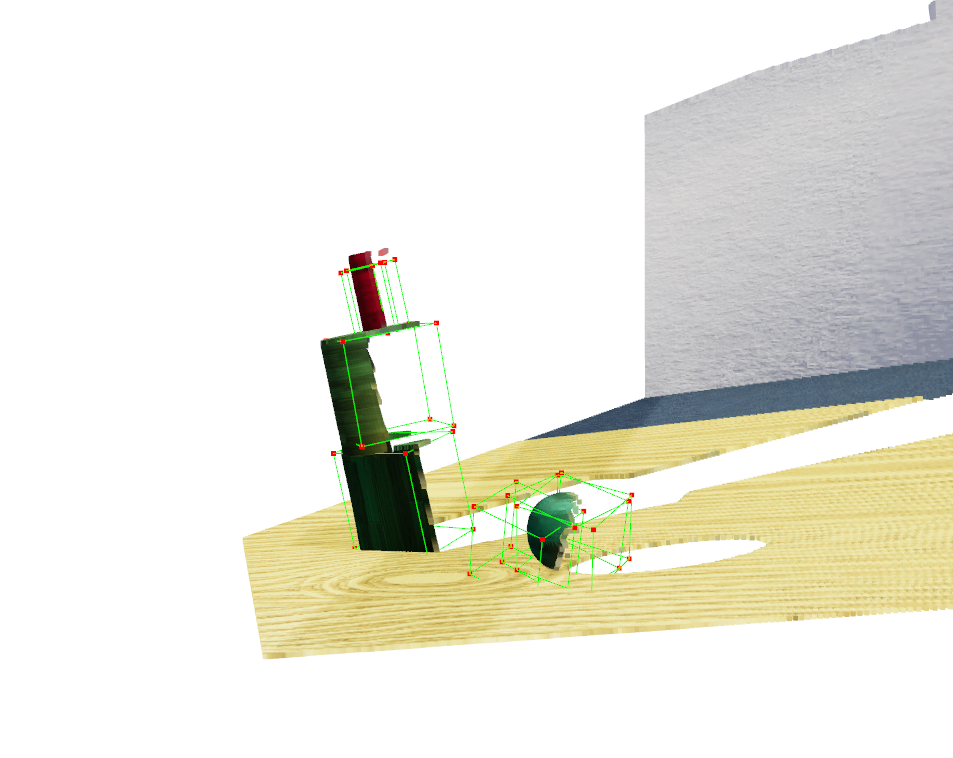
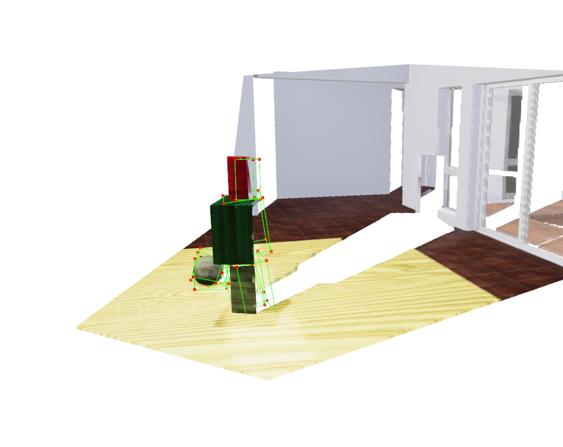
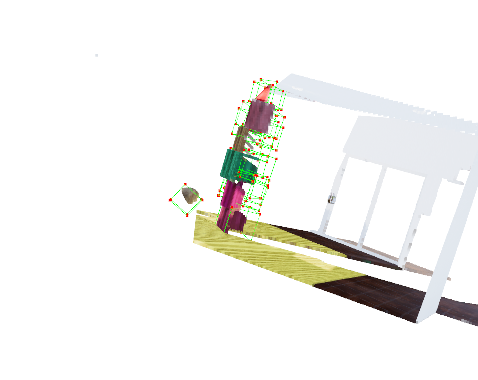

## TR3D-3dof: Towards Real-Time Indoor 3D Object Detection for 3-dof rotation

This repository contains an implementation of TR3D, a 3D object detection method introduced in the paper:

> **TR3D: Towards Real-Time Indoor 3D Object Detection**<br>
> [Danila Rukhovich](https://github.com/filaPro),
> [Anna Vorontsova](https://github.com/highrut),
> [Anton Konushin](https://scholar.google.com/citations?user=ZT_k-wMAAAAJ)
> <br>
> Samsung Research<br>
> https://arxiv.org/abs/2302.02858

The following implementation of TR3D accounts for all three rotation in all 3 dimensions (axes), i.e. yaw, pitch and roll.

### Installation


You can install all required packages manually. This implementation is based on [mmdetection3d](https://github.com/open-mmlab/mmdetection3d) framework.
Please refer to the original installation guide [getting_started.md](docs/en/getting_started.md), including MinkowskiEngine installation, replacing `open-mmlab/mmdetection3d` with `samsunglabs/tr3d`.


Most of the `TR3D`-related code locates in the following files: 
[detectors/mink_single_stage.py](mmdet3d/models/detectors/mink_single_stage.py),
[detectors/tr3d_ff.py](mmdet3d/models/detectors/tr3d_ff.py),
[dense_heads/tr3d_head.py](mmdet3d/models/dense_heads/tr3d_head.py),
[necks/tr3d_neck.py](mmdet3d/models/necks/tr3d_neck.py).


<details>
  <summary>Click to expand installation trials</summary>

| Software                 | Version           | Status                                 |
|--------------------------|-------------------|-----------------------------------------|
| CUDA                     | 11.3              | Cannot Install : Due to the driver version mismatch |
| CUDA                     | 11.7              | Cannot Install : Due to the driver version mismatch |
| CUDA                     | 12.3              | Working                                 |
| Pytorch                  | 1.12.1 + cu 11.3  | Working                                 |
| cudatoolkit              | 11.7              | Working                                 |
| cudatoolkit              | 11.3              | Cannot Install X : Due to unmet dependencies |
| Minkowski Engine         | 0.5.3             | Working                                 |
| gcc and g++ (important)  | 9.5.0             | Working  
</details>

#### Steps to install TR3D package and Minkowski engine
Create a conda env with python 3.8
```bash
conda create -n tr3d python=3.8
```

Use the above version of packages and install them. You may refer to https://github.com/SamsungLabs/tr3d/blob/main/docker/Dockerfile  for the versions of all the packages.

Set the gcc and g++ to be of version 9.5.0 (or upto 10)

Make sure nvcc is installed

```bash
nvcc --version
```

Clone the Minkowski Engine repository and make sure to follow the below instructions


```bash
export CUDA_HOME=/usr/local/cuda-11.x
pip install -U git+https://github.com/NVIDIA/MinkowskiEngine -v --no-deps --install-option="--blas_include_dirs=${CONDA_PREFIX}/include" --install-option="--blas=openblas"
# Or if you want local MinkowskiEngine
git clone https://github.com/NVIDIA/MinkowskiEngine.git
cd MinkowskiEngine
python setup.py install --blas_include_dirs=${CONDA_PREFIX}/include --blas=openblas
```

The code that worked for my system (Ubuntu 20.04 with CUDA 12.1)
```bash
pip install -U git+https://github.com/NVIDIA/MinkowskiEngine -v --no-deps
```

### Getting Started

Please see [getting_started.md](docs/getting_started.md) for basic usage examples.
We follow the mmdetection3d data preparation protocol described in [scannet](data/scannet), [sunrgbd](data/sunrgbd), and [s3dis](data/s3dis).

For physion data preperation refer to [physion](physion).

**Setting up config files**

One can refer to `configs/tr3d/tr3d_physion_fly_config.py` as a template.


**Training**

To start training, run [train](tools/train.py) with TR3D [configs](configs/tr3d):
```shell
python tools/train.py configs/tr3d/tr3d_physion_fly_config.py
```
>**Note**: In order to control the interval of evaluation, change interval at [this line](mmdet3d/apis/train.py#L312).

To train without validation:
```shell
python tools/train.py configs/tr3d/tr3d_physion_fly_config.py --no-validate
```

**Testing**

Test pre-trained model using [test](tools/dist_test.sh) with TR3D [configs](configs/tr3d):
```shell
python tools/test.py configs/tr3d/tr3d_physion_fly_config.py \
    work_dirs/<location of trained model>.pth --eval mAP
```

**Visualization**

Visualizations can be created with [test](tools/test.py) script. 
For better visualizations, you may set `score_thr` in configs to `0.3`:
```shell
python tools/test.py configs/tr3d/tr3d_scannet-3d-18class.py \
    work_dirs/tr3d_scannet-3d-18class/latest.pth --show \
    --show-dir work_dirs/<location to store output visualizations>
```

The above command stores the output in the location provided.

To view the output visualization:
```shell
python physion/output_visualizer.py pilot_towers_nb2_fr015_SJ010_mono0_dis0_occ0_tdwroom_unstable_0014<(location of file)>
```

### Models

The metrics are obtained in 5 training runs which utilizes the `support` type of videos. 
The runs are on a single Nvidia RTX 3080Ti (12GB) GPU. The following table is the result of validation runs.
The mAP and mAR calcuations depend on the [exact 3D IOU](https://pytorch3d.org/docs/iou3d) that has been slightly modified to handle certain edge cases
> **Note** : The access to the models will be shortly updated. Results for `dominoes` will also be updated.

**TR3D 3D Detection**


| Dataset | Loss | Class | AP 0.25 | AR 0.25 | AP 0.50 | AR 0.50 | Download |
|---|---|---|---|---|---|---|---|
| Physion Support | Corners + Huber loss | object | 0.1608 | 0.5322 | 0.0803 | 0.3606 |  TBA   |
| Physion Support | Corners + Chamfer loss | object | 0.7278 | 0.8733 | 0.4813 | 0.7212 |  TBA   |
| Physion Support | 12 direct + Huber loss | object | 0.6609 | 0.9669 | 0.2871 | 0.6472 |  TBA   |

> `corners` regards to usage of loss wrt the 8 corners obtained from the `12d` values learnt. `12d direct` regards to directly using thos values with the loss.


### Example Detections

<div style="text-align: center;">
    
    
    
</div>

### Citation

If you find this work useful for your research, please cite our paper:

```
@misc{rukhovich2023tr3d,
  doi = {10.48550/ARXIV.2302.02858},
  url = {https://arxiv.org/abs/2302.02858},
  author = {Rukhovich, Danila and Vorontsova, Anna and Konushin, Anton},
  title = {TR3D: Towards Real-Time Indoor 3D Object Detection},
  publisher = {arXiv},
  year = {2023}
}
```
